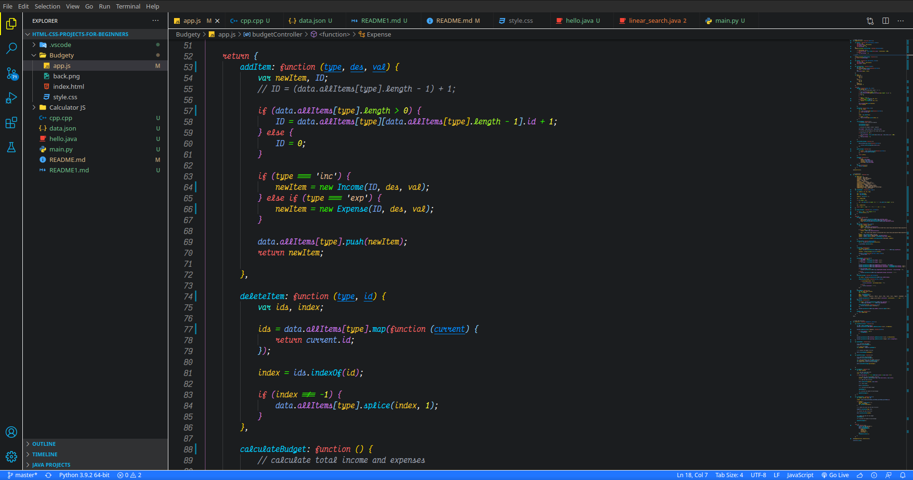
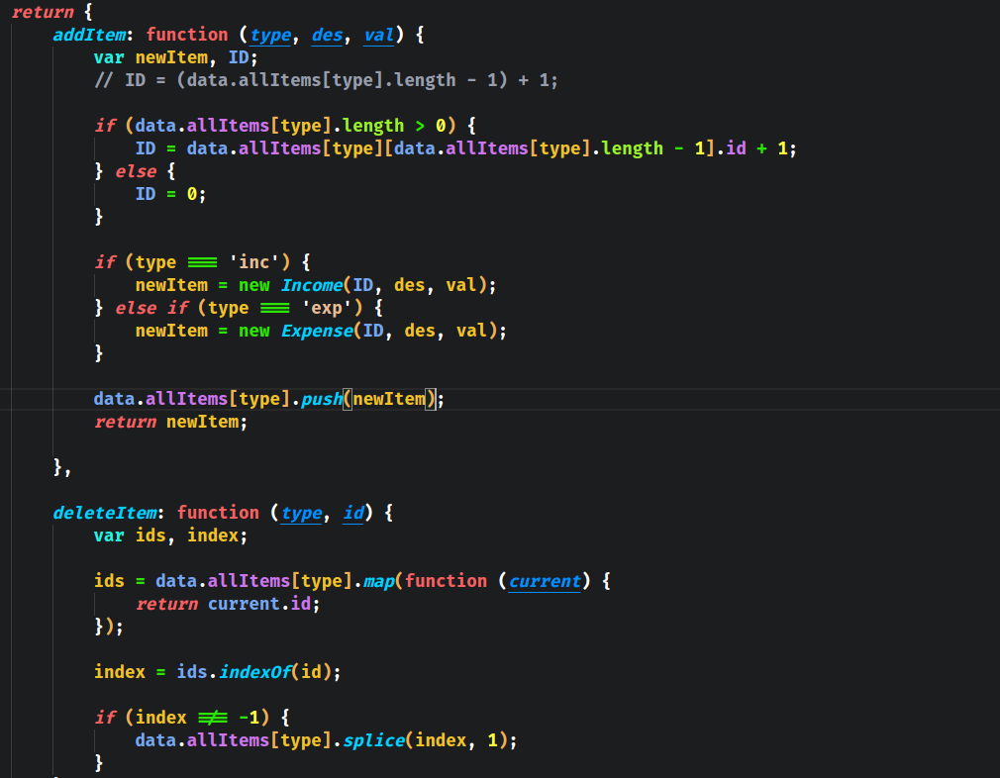
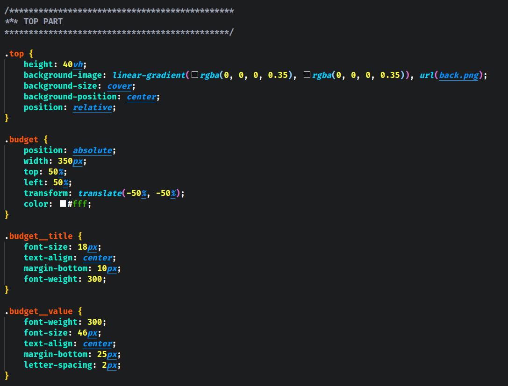
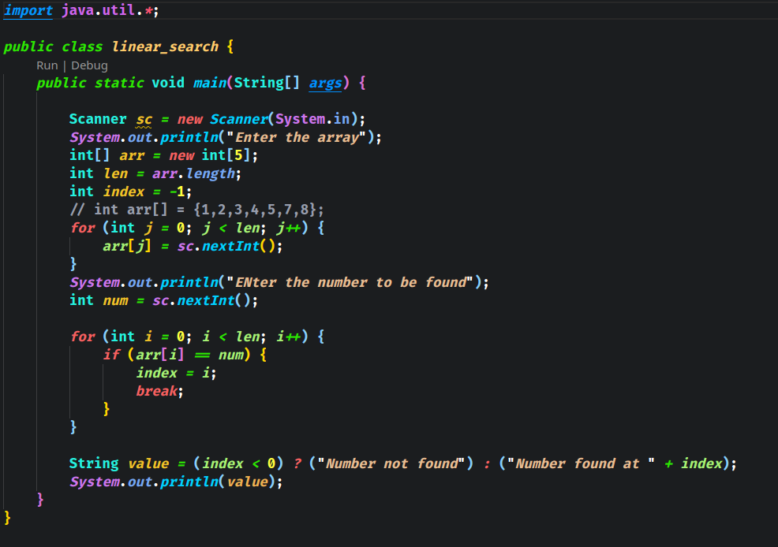
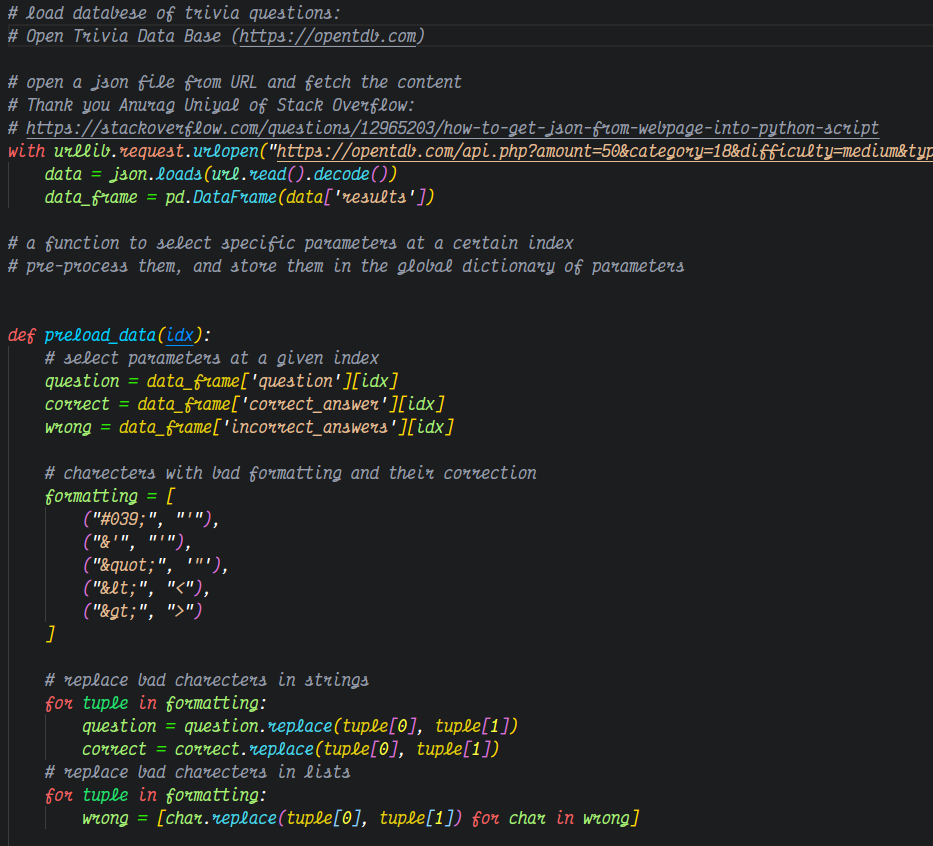
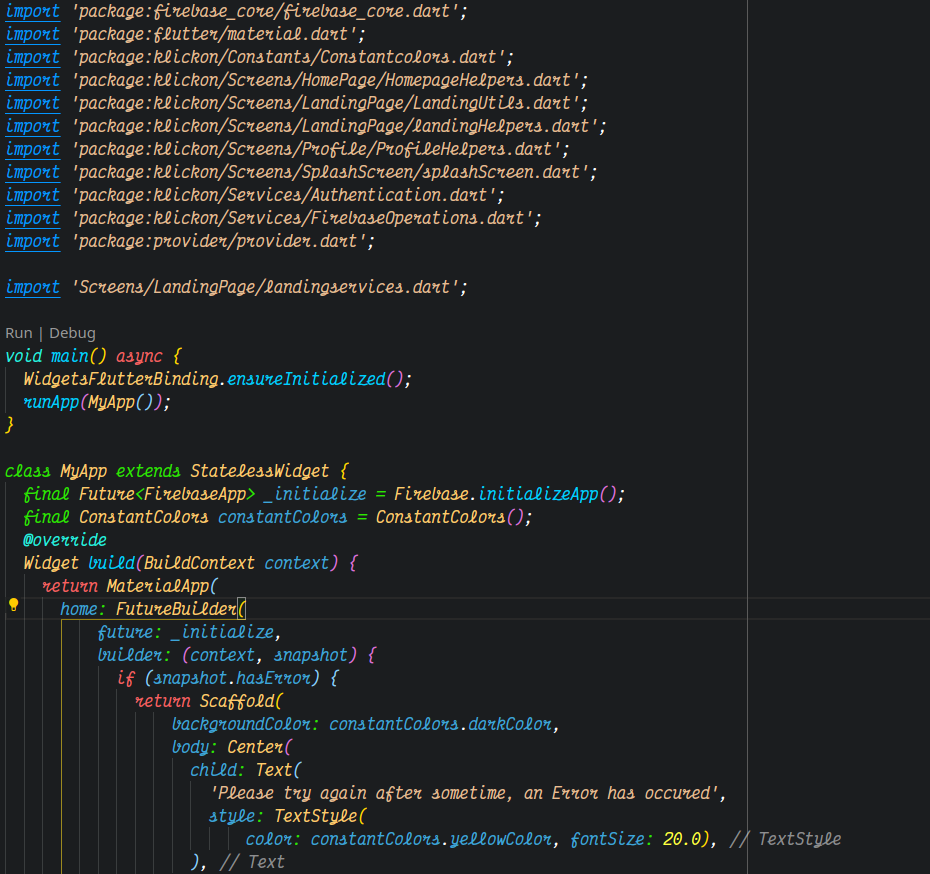
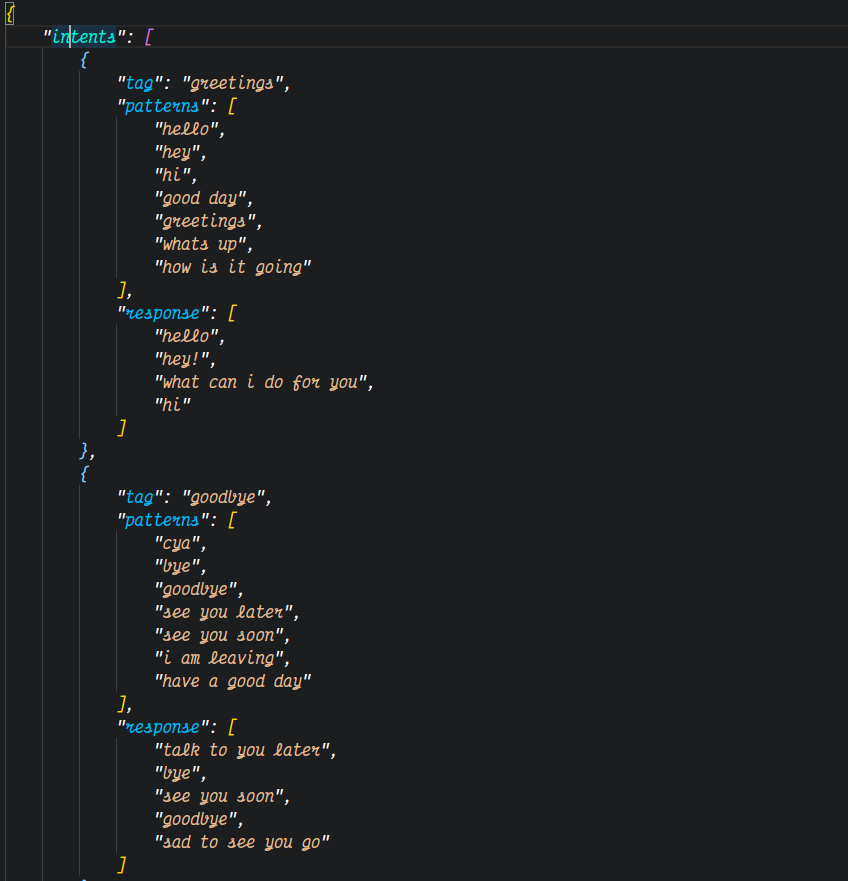
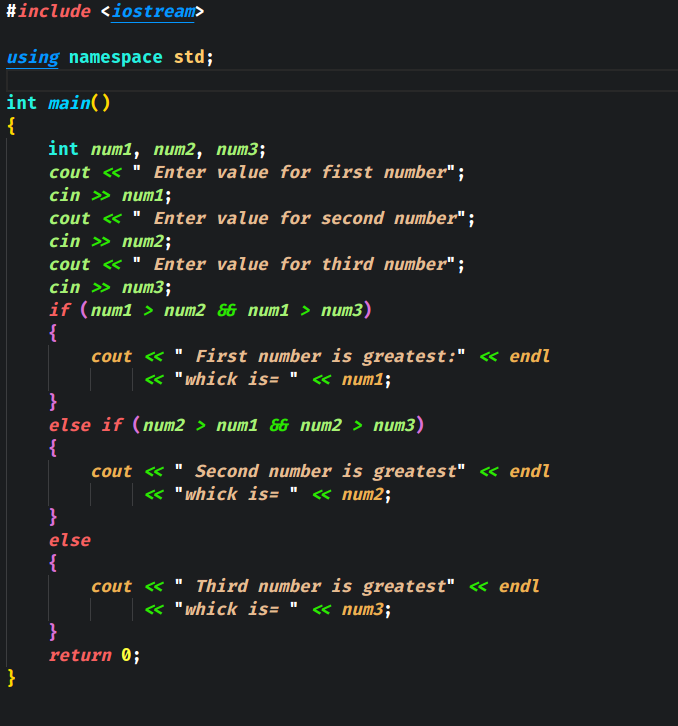
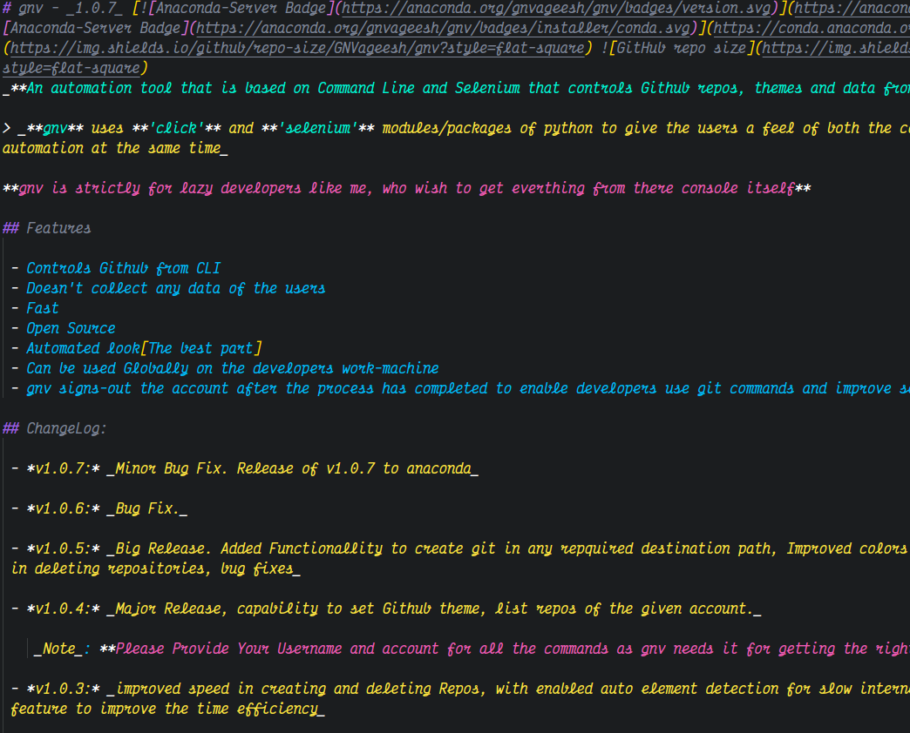

# CODEL
## A Theme For Coded Life - By GNVageesh
This is my very first Visual Studio Code Theme. Inspiration taken from all the themes i used. 
**But wasn't Happy or didn't stick to one particular theme. If it is the same in your case then have this theme in your Coded Life**

### Settings to have

I have used A font called VectorMono, an alternative to OperatorMono. Get it from [here](https://rubjo.github.io/victor-mono/) and finally install it.<br>
Then add the following lines of code to the `settings.json` file

```
{
    "editor.fontFamily": "'Victor Mono'",
    "editor.fontLigatures": true,
}
```

### Preview

- Complete look and feel



- JavaScript



- CSS



- JAVA



- Python



- Flutter/Dart



- JSON



- C/C++



- MarkDown



### ChangeLog

_*v1.0*_ - Initial Release

### License

Refer to the license file [here](License.txt)
